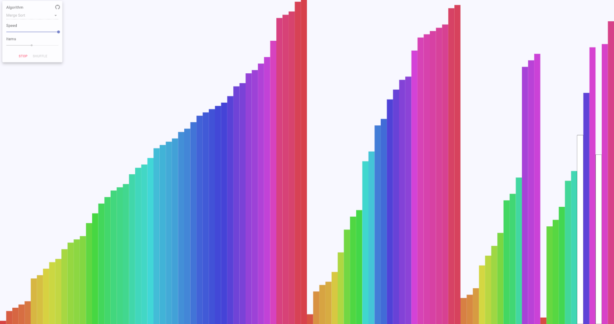

Sorting algorithm visualizer created with React and [Material-UI.](https://material-ui.com/)
Features Merge, Quick, Heap, Insertion, and Selection sort, allowing users to adjust the
speed and number of items to be sorted. Compared items are highlighted during sorting. Try it [here.](https://emmadusmani.github.io/sorting-visualizer)

Credit to [Rafe Autie](https://github.com/rafeautie), whose [sorting visulizer](https://sort.rafe.dev/) served as an inspiration and reference for my own.